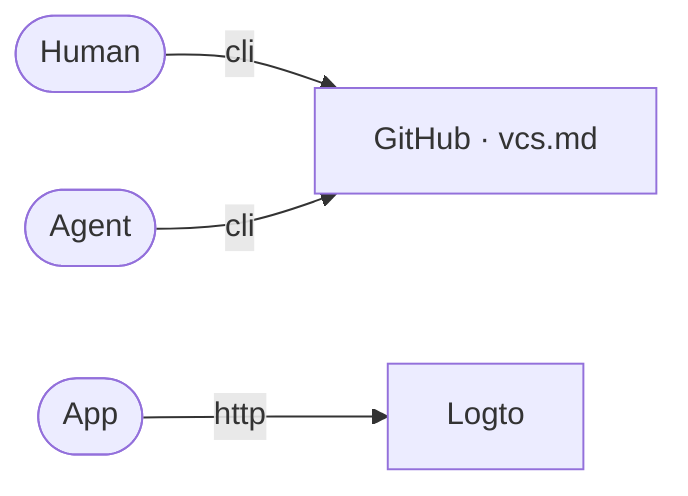

# Ecosystem

```mermaid
flowchart LR
  Human([Human])
  Agent([Agent])
  App([App])
  GitHub["GitHub · vcs.md"]
  Logto["Logto"]

  Human -- cli --> GitHub
  Agent -- cli --> GitHub
  App -- http --> Logto
```
