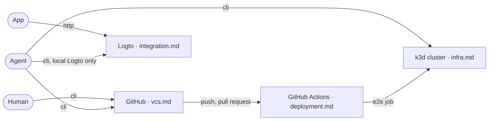

# Ecosystem

```mermaid
flowchart LR
  Human([Human])
  Agent([Agent])
  App([App])
  GitHub["GitHub · vcs.md"]
  Actions["GitHub Actions · deployment.md"]
  Logto["Logto · integration.md"]
  K3d["k3d cluster · infra.md"]

  Human -- cli --> GitHub
  Agent -- cli --> GitHub
  App -- http --> Logto
  Agent -- "cli, local Logto only" --> Logto
  Agent -- cli --> K3d
  GitHub -- "push, pull request" --> Actions
  Actions -- "e2e job" --> K3d
```
